# 随机 8-bit yuv420p 数据的 FFmpeg + x265 编码实验报告

> 研究纯随机 `yuv420p` 数据经 FFmpeg + libx265 编码后的码率、压缩比、画质与 QP 的关系，
> 以及 lossless 正确性、帧结构与编码工具敏感性。
> 所有数据、代码、日志、校验值均在本目录下，可完整复现。

---

## 目录

1. [实验环境与复现方法](#1-实验环境与复现方法)
2. [随机数据生成与随机性验证](#2-随机数据生成与随机性验证)
3. [理论预期](#3-理论预期)
4. [核心实验：QP 与码率/压缩比](#4-核心实验qp-与码率压缩比)
5. [1:1 临界 QP 的统计分析](#5-11-临界-qp-的统计分析)
6. [帧结构（全 I / IP / IPB）对比](#6-帧结构全-i--ip--ipb对比)
7. [画质（MAE/MSE/PSNR）与误差分布](#7-画质maemsepsnr与误差分布)
8. [灰度 (i400) 与 4:2:0 对比：排除 UV 量化差异](#8-灰度-i400-与-420-对比排除-uv-量化差异)
9. [编码工具敏感性](#9-编码工具敏感性)
10. [lossless 正确性检查与 x265 单 CTU 帧 bug](#10-lossless-正确性检查与-x265-单-ctu-帧-bug)
11. [HM 参考解码器交叉校验](#11-hm-参考解码器交叉校验)
12. [重点问题回答](#12-重点问题回答)
13. [局限性](#13-局限性)

---

## 1. 实验环境与复现方法

| 项目 | 值 |
|---|---|
| OS | Ubuntu 24.04 (x86_64, GitHub Actions runner, AMD EPYC 7763, 4 vCPU) |
| FFmpeg | 6.1.1-3ubuntu5 (apt) |
| x265 | 3.5+1-f0c1022b6，8bit+10bit+12bit（经 FFmpeg `libx265` 调用，CLI 版本一致） |
| HM 参考软件 | HM 16.8（`TAppDecoderStatic`，GCC 13 编译需去掉 `-Werror`，见 §11） |
| Python | 3.12.3 + numpy/scipy/pandas/matplotlib |
| C++ 工具 | 本仓库 `experiment/yuvtool.cpp`（基于模板构建，C++20） |

详细版本信息见 [`results/sysinfo.json`](results/sysinfo.json)。

复现步骤：

```bash
git submodule update --init --recursive        # libyuv 需可访问 chromium/GitHub 镜像
sudo apt install ffmpeg x265 libavutil-dev libavcodec-dev libavformat-dev \
                 libswscale-dev libsdl2-dev pkg-config
cmake -S . -B build && cmake --build build -j --target yuvtool
pip install numpy scipy pandas matplotlib
python3 experiment/run_experiments.py --stage all   # 全部 ≈ 4000 次编码，约 1.5 小时
python3 experiment/analyze.py
```

固定基准编码参数（全部实验共用，保证确定性并逐项叠加变体）：

```
frame-threads=1:pools=4:log-level=info
```

- 每次编码记录：请求参数、**实际 I/P/B 帧数与逐类型平均 QP**（解析 x265 日志）、
  编码墙钟时间、原始裸数据/HEVC 裸码流（Annex-B）/MP4 容器三种大小、解码回原始格式后
  的逐字节比较与 MAE/MSE/PSNR/最大误差（Y/U/V 分开）。
- 原始 CSV：[`results/core_sweep.csv`](results/core_sweep.csv)（约 3100 行）、
  [`results/tool_sensitivity.csv`](results/tool_sensitivity.csv)、
  [`results/gray_sweep.csv`](results/gray_sweep.csv)。
- 每个输入样本记录 SHA-256（CSV `input_sha256` 列）；保留的 40 条代表性码流的
  SHA-256 在 [`results/stream_sha256.txt`](results/stream_sha256.txt)。

## 2. 随机数据生成与随机性验证

`yuvtool gen` 直接按平面顺序 (Y→U→V) 生成随机字节；三种随机源：

- `mt19937`：`std::mt19937_64` 固定种子（主实验用，可复现，每个样本种子记录在 CSV）；
- `/dev/urandom`；
- `/dev/random`（现代内核已与 urandom 同源，不阻塞，实测可用）。

`yuvtool stats` 对 256×256×10 帧样本（983 040 字节）的检验结果
（完整输出见 [`results/randomness.json`](results/randomness.json)）：

| 源 | 熵 (bit/byte) | χ² (255 df) | lag-1 相关 | U-V 相关 | 重复 16B 块 | 相邻帧相同 |
|---|---|---|---|---|---|---|
| mt19937 seed=1 | 7.99982 | 245.9 | −6.4e−4 | 1.4e−3 | 0 | 0 |
| mt19937 seed=2 | 7.99981 | 253.5 | −1.1e−3 | −3.7e−4 | 0 | 0 |
| mt19937 seed=3 | 7.99983 | 233.2 | −1.0e−3 | 1.1e−3 | 0 | 0 |
| /dev/urandom | 7.99979 | 284.8 | −5.2e−4 | 2.6e−4 | 0 | 0 |
| /dev/random | 7.99981 | 254.0 | 1.7e−4 | 1.8e−3 | 0 | 0 |

χ² 均落在 255 自由度分布的正常区间（均值 255，95% 区间约 [210, 300]）；
熵接近理论上限 8 bit/byte（有限样本下期望略低于 8）；平面内相邻相关、平面间相关
均在 ±2e−3 的抽样噪声内；无重复块、无重复帧。**三种源统计上不可区分**，
后续结论对随机源不敏感，主实验使用固定种子 mt19937 以保证可复现。

## 3. 理论预期

- i.i.d. 均匀随机字节的熵为 8 bit/byte，**任何无损编码器的期望输出都不可能小于输入**
  （香农源编码定理）；对固定码本的实际编码器，输出必然更大，因为码流还要携带
  SPS/PPS/slice header、CU/PU/TU 划分、模式标志、CABAC 上下文自适应的损耗等结构开销。
- HEVC 的变换+量化+CABAC 是为**有空间/时间相关性**的信号设计的；随机数据没有可利用
  的相关性：帧内预测残差仍是随机的，运动估计找不到匹配，变换后系数仍是满带宽的。
- 有损路径中量化是唯一能减小体积的环节：QP 越大，量化步长越大，残差系数被压得越小，
  码率单调下降 —— 因此**必然存在某个 QP 使输出 ≈ 输入（1:1 临界 QP）**，
  但其值与结构开销、帧类型、分辨率有关，需实验确定。

## 4. 核心实验：QP 与码率/压缩比

矩阵：8 个配置（64×64/128×128/256×256/640×360 × 10 帧；256×256 × 1/30 帧；
256×256×10 的三种帧结构）× (lossless + 17 个固定 QP ∈ {0,4,8,10,…,20,24,…,51})
× 10–30 个独立随机样本，共约 3100 次编码；另有 CRF ∈ {0,10,18,28,40,51} 对照 60 次。

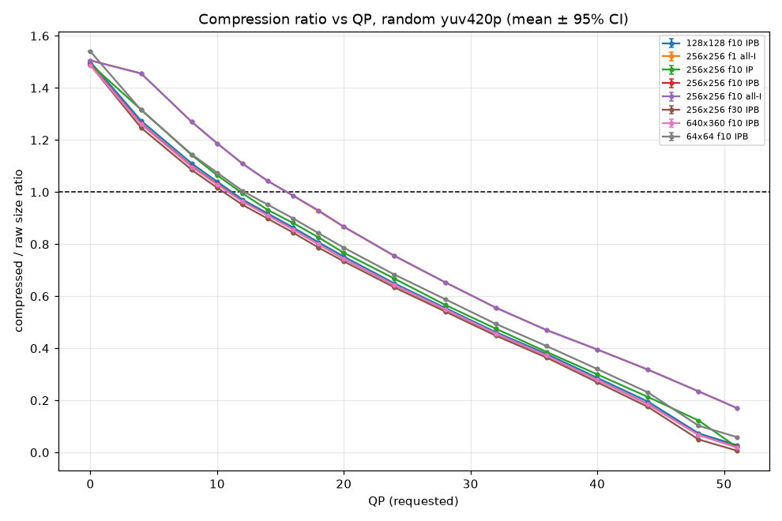

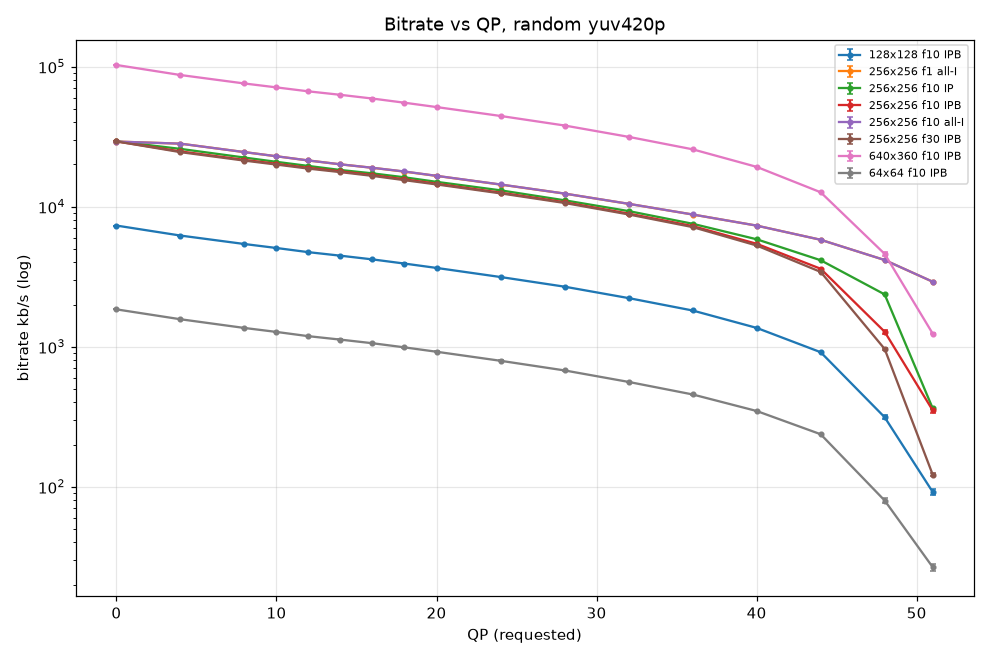

要点（数值见 [`results/summary_core.csv`](results/summary_core.csv)）：

- **lossless 输出恒大于输入**：所有 170 次 lossless 编码压缩比均 > 1，
  平均 **1.330**（256×256 f10 IPB，95% CI ±0.0005），范围 1.323–1.384。
  分辨率越小开销越大（64×64 为 1.382，因帧头/结构开销占比更高）。
- QP=0（有损路径）比 lossless 更大：1.489 ± 0.0001 —— 有损路径在 QP0 时残差几乎不损失
  （max_err ≤ 2），但仍要编码几乎满精度的变换系数，加上变换域表示的膨胀比空域旁路
  （lossless 用 `transquant_bypass`）更不划算。
- QP 与码率近似**线性**关系（而非典型自然视频的指数关系）：随机数据下每 +1 QP
  码率下降约 2%（绝对值约 500 kb/s @256×256），直到 QP≈45 后加速跌向纯结构开销底线。
- QP=51 时压缩比仅 0.02（几乎全部信息被量化丢弃，PSNR≈10.5 dB）。
- CRF 模式对照（[`results/summary_crf.csv`](results/summary_crf.csv)）：CRF=0 时实际
  平均 QP=11.55、压缩比 1.014，CRF 的自适应 QP 分配在随机数据上与固定 QP 无本质差异。
- 容器开销：MP4 相对裸 HEVC 码流平均 +0.7%（大码流 <0.1%，最小码流 QP51 时可达 +27%）。
  所有对比均以**裸 Annex-B HEVC 码流 vs 原始裸 yuv420p** 为准。

## 5. 1:1 临界 QP 的统计分析

对每个样本的 QP 扫描曲线做线性插值求 ratio=1.0 的交点
（[`results/critical_qp_samples.csv`](results/critical_qp_samples.csv)），
再按配置聚合（[`results/summary_critical_qp.csv`](results/summary_critical_qp.csv)）：

| 配置 | n | 临界 QP 均值 | 标准差 | 95% CI | min–max |
|---|---|---|---|---|---|
| 64×64 f10 IPB | 20 | **12.17** | 0.125 | ±0.058 | 11.96–12.41 |
| 128×128 f10 IPB | 20 | **11.17** | 0.057 | ±0.027 | 11.06–11.29 |
| 256×256 f10 IPB | 30 | **10.93** | 0.037 | ±0.014 | 10.87–11.02 |
| 640×360 f10 IPB | 10 | **10.88** | 0.015 | ±0.011 | 10.85–10.90 |
| 256×256 f30 IPB | 10 | **10.51** | 0.018 | ±0.013 | 10.48–10.53 |
| 256×256 f10 IP | 30 | **11.86** | 0.049 | ±0.018 | 11.75–11.98 |
| 256×256 f10 all-I | 30 | **15.51** | 0.013 | ±0.005 | 15.47–15.53 |
| 256×256 f1 all-I | 20 | **15.51** | 0.020 | ±0.009 | 15.46–15.54 |

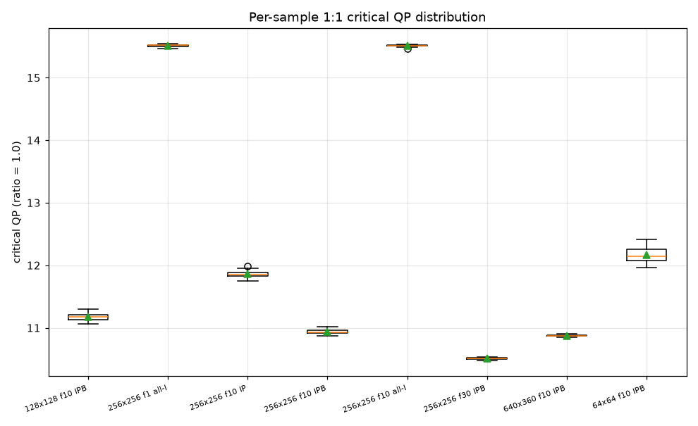

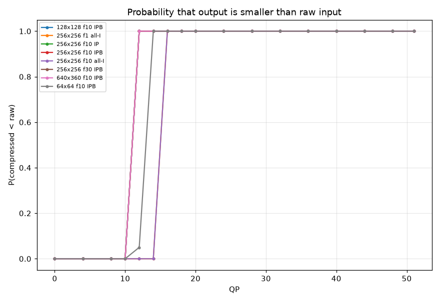

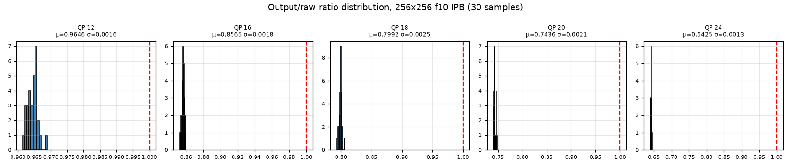

结论：

- **存在非常稳定的统计意义上的 1:1 临界 QP**。单样本临界 QP 的标准差只有
  0.01–0.13 QP，95% 置信区间宽度 < 0.12 QP；P(输出<输入) 在临界 QP 两侧的相邻
  测试点（如 256×256 IPB 的 QP10 → QP12）从 0% 跳到 100%，几乎没有过渡区。
- **临界 QP 随配置系统性变化**：
  - 帧结构影响最大：all-I ≈ 15.5，IP ≈ 11.9，IPB ≈ 10.9（见 §6）；
  - 分辨率越小临界 QP 越高（结构开销占比大，需要更强量化抵消）：64×64 为 12.2；
    128×128 → 640×360 之间仅差 0.3；
  - 帧数越多临界 QP 略降（10 帧 10.93 → 30 帧 10.51，非 I 帧占比升高）；
    单帧 all-I 与 10 帧 all-I 无差别（15.51）；
  - 样本数量只影响置信区间宽度，不改变均值（10 vs 30 样本结论一致，已收敛）。
- 固定 QP 下输出大小近似正态：Shapiro–Wilk p 值在大多数 QP 点 > 0.05
  （30 样本，`summary_core.csv` 的 `shapiro_p` 列）；个别点（QP20、QP51）p<0.05，
  属于多重检验下的正常现象且未见系统性偏态。相对标准差极小（σ/μ ≈ 0.1–0.3%），
  这与"随机数据没有内容差异、码流大小仅由结构+熵编码涨落决定"一致。

## 6. 帧结构（全 I / IP / IPB）对比

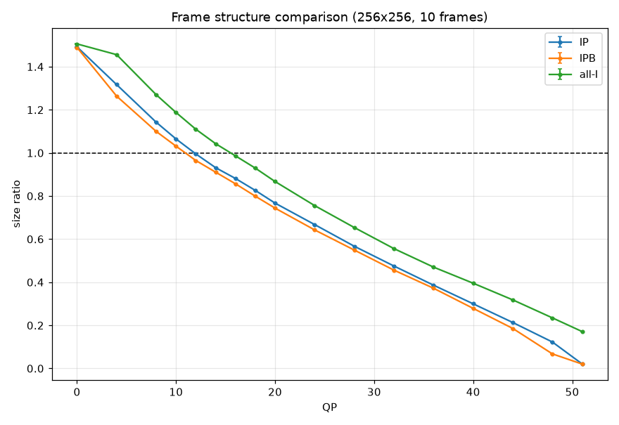

- 实际帧类型均已从 x265 日志核对（CSV `frames_I/P/B` 列；scenecut 全部关闭，
  GOP 按 `keyint/min-keyint/bframes` 精确控制，代表性完整日志在 `results/logs/`）。
- lossless 下三种结构几乎无差别（1.330 vs 1.331 vs 1.333）：帧间预测在随机数据上
  完全找不到增益，P/B 帧的 CU 最终仍然全部编码为帧内/满残差，只是 slice 头略有不同。
- 有损（QP>0）时 IPB < IP < all-I（输出更小），主要原因**不是**预测有效，而是
  x265 对 P/B 帧默认施加更大的实际 QP（QP offset：同一请求 QP=16 时，实测
  I=13.0 / P=16.0 / B≈17.7，CSV `avgqp_*` 列），以及 B 帧的加权双向"预测"平均掉了
  部分噪声（等效低通）。代价是 PSNR 同步下降，并非免费收益。
- 因此帧结构对临界 QP 的影响（15.5 → 11.9 → 10.9）本质上是**帧类型 QP 偏移**的体现：
  以实际平均 QP 衡量时三种结构的临界点更接近。

## 7. 画质（MAE/MSE/PSNR）与误差分布

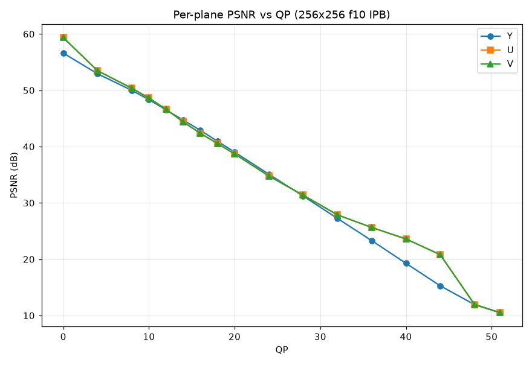

- PSNR 随 QP 精确线性下降（256×256 IPB：QP8→50.0 dB，QP16→42.9 dB，QP24→35.1 dB，
  斜率 ≈ −0.98 dB/QP，直至 QP≈45 饱和到 ~10.5 dB —— 即输出趋于常数灰图）。
- QP16 时误差分布（|err| 占比）：0→23%，1→37%，2→22%，3→11%，4→4.5%，
  尾部快速衰减，max_err=10；近似双边几何/拉普拉斯分布，符合量化噪声预期。
- Y/U/V 误差基本对称（QP16：Y 42.90 dB / U 42.36 dB / V 42.36 dB），低 QP 时
  U/V 反而略优于 Y（QP8：U/V 50.4 vs Y 50.0 dB），高 QP（≥36）时 U/V 明显好于 Y
  （QP40：U 23.6 vs Y 19.3 dB），这来自 HEVC 色度 QP 映射表在高 QP 段的压缩
  （chroma QP < luma QP）。详见 §8 的对照。

## 8. 灰度 (i400) 与 4:2:0 对比：排除 UV 量化差异

为验证"UV 量化与 Y 不一致"是否影响结论，用 `-pix_fmt gray`（HEVC Main 4:0:0，
x265 i400）对纯随机 Y 平面做了同样的 QP 扫描（15 样本 × 18 个码控点，
[`results/summary_gray_vs_420.csv`](results/summary_gray_vs_420.csv)）：

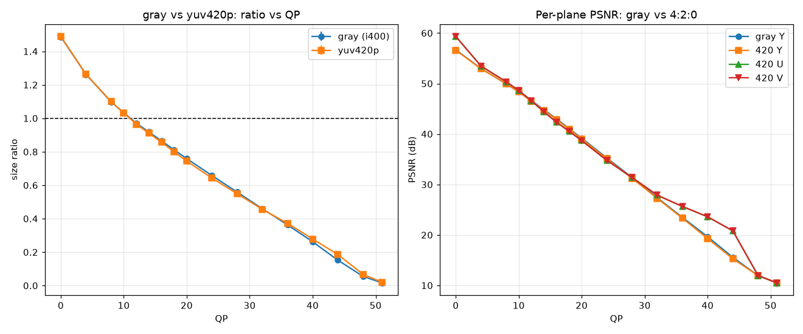

| 指标 | yuv420p | gray (i400) |
|---|---|---|
| 临界 QP（256×256 f10 IPB） | 10.93 ± 0.014 | **11.05 ± 0.009** |
| QP12 压缩比 | 0.9646 | 0.9703 |
| QP16 Y-PSNR | 42.90 dB | 43.02 dB |

结论：去掉色度平面后临界 QP 仅 +0.11，Y-PSNR 差 ≈ 0.1 dB。**色度 QP 偏移对
"随机数据可压缩性"的结论没有实质影响**；4:2:0 下 U/V 在高 QP 段获得的额外保真
（§7）只是色度 QP 映射的副作用，不改变 1:1 临界点的量级与稳定性。

## 9. 编码工具敏感性

以固定基准（256×256×10、IPB、`frame-threads=1:pools=4`）为参照，**一次只改一个参数**，
在 lossless / QP16（临界点附近）/ QP32 三个码控点各测 5 个独立样本（44 个变体，共 ~2000
次编码）。每个变体都用 x265 日志的 `tools:` 行验证**是否实际生效**
（[`results/summary_tools.csv`](results/summary_tools.csv)，图中绿=更小，红=更大）：

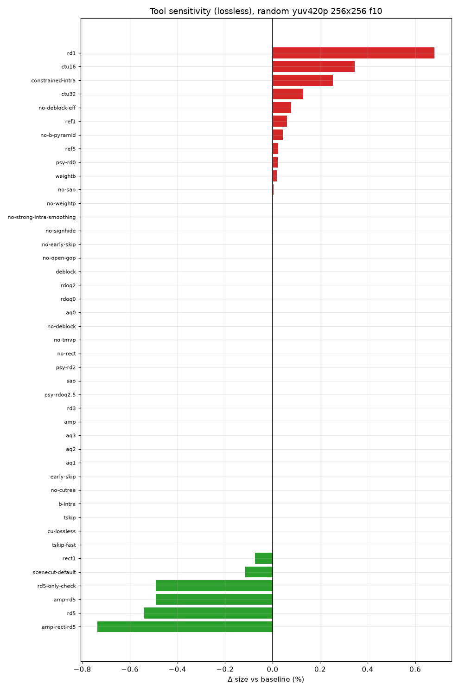
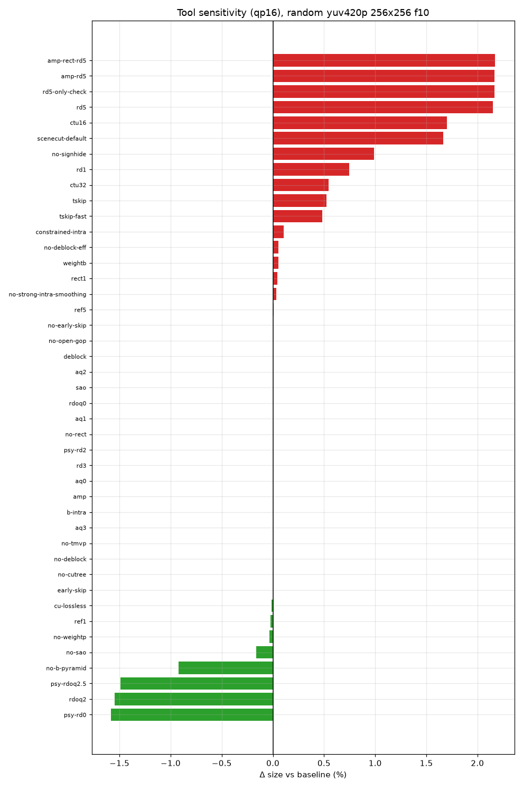
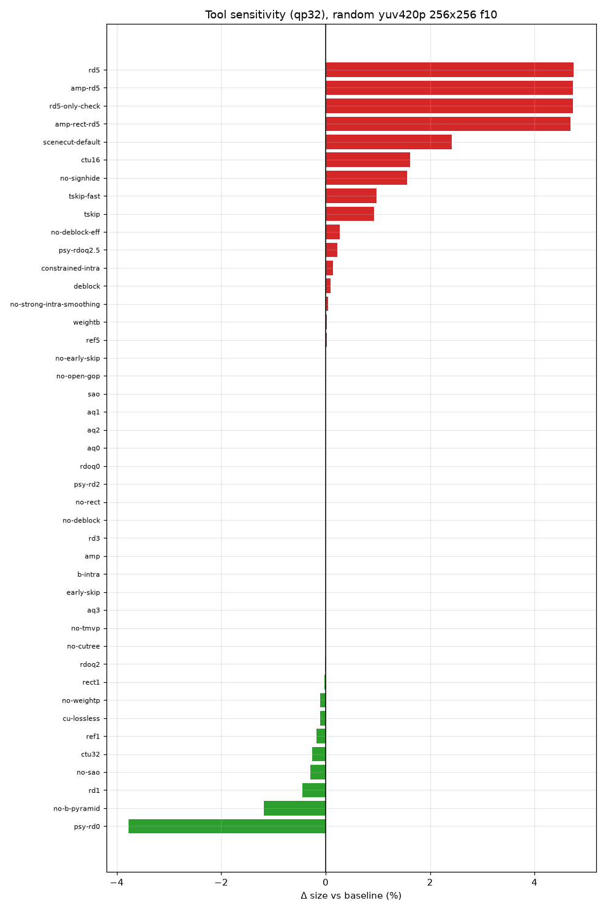

主要发现（Δ 为相对基准的码流大小变化）：

| 工具 | lossless | QP16 | QP32 | 说明 |
|---|---|---|---|---|
| SAO（默认开）→ 关 | +0.004% | −0.16% | −0.30% | lossless 下 SAO 被规范禁用（`pps_transquant_bypass` CU 不滤波），日志确认无效果；有损下 SAO 对噪声无增益、反而花费 SAO 参数比特，**关掉更小且 PSNR 更高**（QP32 时 −0.24 dB→关掉后损失消失） |
| Deblock（默认开）→ 关 | +0.08% | +0.05% | +0.27% | lossless 下同样不作用于旁路 CU。有损下关掉 deblock 输出略大（RDO 参考帧质量变化的二阶效应）但 **PSNR 提高 +0.19 dB (QP16)** —— 去块滤波在随机数据上纯粹是"把噪声抹平"，损害保真度；编码时间 −24% |
| Transform Skip | −0.0002% | +0.52% | +0.09% | 随机残差在变换域和空域同样不可压，tskip 无收益 |
| AMP | 0（未生效） | 0（未生效） | — | x265 要求 rect+rd≥4 才启用；补测 `rect=1:amp=1:rd=5` 后与纯 `rd=5` 完全等值 → AMP 对随机数据零作用 |
| RDO 级别 rd=1/3/5 | −0.54% (rd5) | +0.75% (rd1) / +2.15% (rd5) | −0.45% (rd1) / +4.7% (rd5) | 唯一在 lossless 下有可测收益的工具（更充分的划分搜索省 0.5% 结构比特，代价 +87% 时间）。有损下 rd5 反而**更大**：psy-rd 在高 rd 级别更激进地保留噪声能量（PSNR +1.16 dB @QP16） |
| RDOQ (rdoq-level=2) | 0 | −1.55%（PSNR +2.19 dB） | −0.01%（PSNR +2.45 dB） | 对随机数据 RDOQ 同时省码率、提 PSNR，是**少数真正有效的工具**（默认 medium 未开启RDOQ） |
| psy-rd 2.0（默认）→ 0 | +0.02% | **−1.58%** | **−3.77%** | psy-rd 会刻意保留"视觉能量"（即噪声），关掉后码流明显更小、PSNR 仅 −0.12～−0.18 dB。对随机数据 psy-rd 是纯浪费 |
| Early Skip / rskip | 0 | ±0.0004% | ±0.001% | 无预测增益可跳过，几乎无效 |
| cu-lossless | −0.0002% | −0.01% | −0.10% | lossless 模式下无变化；有损下偶尔选中旁路 CU |
| ref=1→5 | +0.06%→+0.02% | ±0.02% | ±0.17% | 参考帧数量无意义（找不到匹配） |
| weightp 关 / weightb 开 | +0.002% / +0.02% | −0.04% / +0.05% | −0.10% / +0.02% | 加权预测对零相关帧无用 |
| scenecut=40（默认） | −0.12% | +1.66% | +4.02% | 随机帧间"场景切换"检测被触发（实测 I 帧 1→2），多出的 I 帧在有损下更贵 —— 这验证了基准里关掉 scenecut 的必要性 |
| AQ mode 0–3 | 0 | 0 | 0 | CQP/lossless 下 AQ 不参与（日志确认），完全无效果 |
| psy-rdoq 2.5 | 0 | −1.49% | −0.01% | 效果与 rdoq-level=2 基本一致（增益来自 RDOQ 本身） |
| CTU 32/16 | +0.13% / +0.35% | +0.54% / +1.70% | −0.25% / +1.0% | 小 CTU 增加结构开销；但编码时间 −18%～−35% |
| signhide 关 | +0.0002% | +0.99% | +0.34% | 符号位隐藏对随机系数仍有效（每 TU 省 1 bit），是**对随机数据有效的少数工具之二** |
| b-pyramid 关 | +0.04% | −0.92% | −1.19% | B 金字塔的参考层级在噪声上是负收益 |
| strong-intra-smoothing 关 / constrained-intra 开 / tmvp 关 / cutree 关 / b-intra / open-gop 关 | ≈0 | <±0.1% | <±0.1% | 全部无实质影响 |

**lossless 模式下所有 44 个变体（每变体 5 样本）解码输出均与输入逐字节一致**
（`identical_all=True`，256×256 无单 CTU 帧问题，见 §10）。
SAO/Deblock 在 lossless 下的"无作用"是 HEVC 规范行为：`transquant_bypass` CU
跳过环内滤波，实验数据（差异 <0.1%，来自 RDO 噪声）与规范一致。

## 10. lossless 正确性检查与 x265 单 CTU 帧 bug

所有 lossless 输出均解码回 `yuv420p` 并与原始输入**逐字节比较**（`yuvtool compare`）：

- 170 次核心 lossless 编码中 **153 次逐字节一致**；
- **17 次不一致，全部集中在 64×64（IPB）配置**，误差只出现在部分 P/B 帧
  （max_err 最高 156，I 帧全部无损）；
- 定位实验（一次一个变量）：
  - `keyint=1`（全 I）→ 无损 ✔；`bframes=0`（IP）→ 仍出错 ✘；
  - `ctu=32` → 无损 ✔；96×64（宽 1.5 CTU）→ 无损 ✔；64×64 + 默认 `ctu=64` → 出错 ✘；
  - 与 sao/deblock/rskip/b-pyramid/weightp/ref/search-range 均无关；
  - HM 与 FFmpeg 对该码流的解码结果**完全一致** → 错误发生在**编码器**侧，
    即 x265 生成的码流本身不是无损的，且没有触发任何一致性告警。

**结论：x265 3.5 存在真实 bug —— 当"一帧恰好等于单个 64×64 CTU"且启用帧间预测
（P 或 B 帧）时，`lossless=1` 实际不无损。** 规避方法：该场景下用 `ctu=32` 或全 I。
（复现码流已提交：`results/streams/core_64x64_f10_IPB_lossless.hevc`，
输入可由 CSV 中的种子重新生成。）

除此之外的所有配置（128×128 及以上、64×64 全 I）lossless 均逐字节一致；
lossless 与有损的界限在统计表中严格区分（`rc_mode` 列），不存在"标称 lossless、
实际有损"被计入 lossless 统计的情况——上述 17 个失败样本在
[`results/lossless_consistency.json`](results/lossless_consistency.json) 中单独披露。

## 11. HM 参考解码器交叉校验

HM 16.8 `TAppDecoderStatic`（clone 自 GitHub 镜像 `listenlink/HM`，
GCC 13 下需将 `-Werror` 移除并压制 `-Wclass-memaccess` 等新警告，属于
老代码 vs 新编译器问题，未改动任何逻辑代码；**未遇到运行期断言失败**）。

对 40 条保留码流（8 配置 × lossless/QP0/16/32/51）逐条用 HM 解码：

- 40/40 解码成功（exit 0，无一致性错误、无断言失败）；
- 40/40 HM 重建 YUV 与 FFmpeg 解码结果**逐字节一致**
  （[`results/hm_check.json`](results/hm_check.json)）；
- 说明 x265 码流规范合法、FFmpeg hevc 解码器与参考解码器行为一致，
  §10 的 lossless 失配可确证为编码端问题。

## 12. 重点问题回答

**Q1 随机 yuv420p 为什么在 x265 lossless 下比原始数据更大？**
输入已是 8 bit/byte 满熵源，无损编码没有任何冗余可去除（香农界），而 HEVC 码流必须
额外携带头信息、CU/PU/TU 结构、模式标志和 CABAC 旁路/上下文编码的效率损失。实测
膨胀约 **+33%**（256×256，95% CI ±0.05%），小分辨率更大（64×64 为 +38%）。CABAC 对
均匀随机比特的旁路编码本身接近 1:1，主要膨胀来自结构语法与残差编码的前缀开销。

**Q2 I/P/B 结构和常见编码工具对随机数据的实际影响？**
lossless 下帧结构几乎无差别（±0.3%），帧间预测完全失效。有损下 IPB<IP<all-I 主要由
帧类型 QP 偏移导致而非预测增益。工具方面：对随机数据**唯一持续有效**的是
RDOQ（−1.5%，且 PSNR +2.2 dB）和 signhide（默认已开，关掉 +1%）；rd=5 只在
lossless 下小幅省 0.5%；psy-rd（默认 2.0）在有损下纯属浪费（关掉省 1.6–3.8%）；
SAO/Deblock 在 lossless 下被规范旁路、在有损下无压缩收益且 deblock 还损害 PSNR；
tskip/AMP/AQ/参考帧/加权预测/early-skip/tmvp/cutree 等全部无实质作用；
scenecut 会把随机帧误判为场景切换（多出 I 帧），应显式关闭。

**Q3 QP 与码率的关系？**
近似线性：每 +1 QP 码率降约 2%（不同于自然视频的指数律），QP≈45 后迅速塌缩到
纯结构开销底线（QP51 时输出仅为输入的 2%）。QP0（有损）比 lossless 更大（1.49 vs 1.33）。

**Q4 是否存在稳定的统计意义上的 1:1 临界 QP？**
存在且异常稳定。固定配置下单样本临界 QP 标准差仅 0.01–0.13 QP；
256×256×10 IPB 下为 **10.93 ± 0.04**；P(输出<输入) 在临界点两侧从 0 突变到 1。

**Q5 临界 QP 是否随分辨率、帧数、样本数量和编码参数变化？**
随配置系统性变化：帧结构影响最大（all-I 15.5 / IP 11.9 / IPB 10.9），
分辨率次之（64×64 12.2 → 640×360 10.9，大分辨率趋于收敛），
帧数小幅影响（30 帧 10.5），灰度模式 +0.1；样本数量只收窄置信区间不移动均值。
工具中会移动临界点的只有 RDOQ/psy-rd/signhide/rd 级别（约 ±0.3 QP 量级，
按 QP16 附近 2%/QP 的斜率折算）。

**Q6 lossless 解码后是否与输入完全一致？**
绝大多数一致（153/170 + 工具实验 220/220 @256×256），且 HM 与 FFmpeg 双解码器
交叉验证一致。**例外：x265 3.5 在"帧=单个 64×64 CTU + P/B 帧"时 lossless 实际有损**
（17/17 个 64×64 IPB 样本失败，已隔离出触发条件与规避方法，见 §10）。
任何未逐字节验证的"lossless"标签都不可信 —— 本实验将该发现单列，未计入无损统计。

## 13. 局限性

- x265 仅测 3.5（Ubuntu 24.04 发行版），未对比 3.6+/master；bug 可能已在新版修复。
- 分辨率上限 640×360、帧数上限 30：更大分辨率下结构开销占比更小，
  临界 QP 可能继续小幅下降后收敛（本实验 256→640 已趋平）。
- `--preset` 固定为默认 medium 基线，未做 preset 全扫描（rd/early-skip 等
  关键因素已单独覆盖）。
- HM 用 16.8 镜像（非最新 HM 18.x），但对 Main/Main 4:0:0 8bit 码流的一致性
  检查足够严格（发现问题的能力已由 §10 的编码端 bug 验证：HM 正常解码
  说明码流语法合法，错在重建值本身即编码器写入的残差）。
- `/dev/random` 在现代内核与 urandom 同源；未使用硬件 TRNG。
- 1:1 临界 QP 用相邻 QP 点线性插值；QP 只能取整数，工程上应理解为
  "QP ≤ 10 时输出必然更大，QP ≥ 12 时必然更小"（256×256 IPB）。
